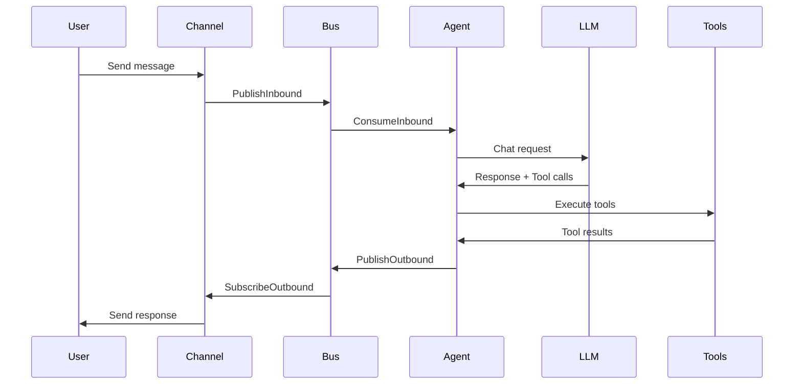

## System Architecture

Weaver is built for **high-density, low-latency AI agent orchestration**. It achieves sub-second boot times and minimal memory footprint (&lt;10MB per agent) through a carefully designed Go-based architecture.

<Frame>
  
</Frame>

## Core Components

Weaver's architecture consists of four primary components that work together to enable efficient agent orchestration:

<CardGroup cols={2}>
  <Card title="Agent Loop" icon="rotate" href="/concepts/agents">
    Core processing engine that handles LLM interactions and tool execution
  </Card>
  <Card title="Message Bus" icon="message" href="/concepts/channels">
    Pub/sub system for routing messages between channels and agents
  </Card>
  <Card title="Gateway" icon="server" href="/concepts/gateway">
    Central dispatcher that manages channels and coordinates agent lifecycles
  </Card>
  <Card title="Workspace" icon="folder" href="/concepts/workspace">
    Isolated directory structure for agent memory and file operations
  </Card>
</CardGroup>

## Message Flow

The following diagram illustrates how messages flow through the Weaver system:



## Key Design Principles

<AccordionGroup>
  <Accordion title="Workspace Isolation">
    Each agent operates within a dedicated workspace directory, providing:
    - **File system isolation** with optional restriction to workspace boundaries
    - **Session persistence** for conversation history and memory
    - **Tool execution context** that prevents unauthorized file access
    - **State management** for atomic operations that survive crashes

    ```go
    type AgentLoop struct {
        workspace      string
        sessions       *session.SessionManager
        state          *state.Manager
        tools          *tools.ToolRegistry
        // ...
    }
    ```
  </Accordion>

  <Accordion title="Async Message Bus">
    The message bus uses buffered channels for non-blocking communication:

    ```go
    type MessageBus struct {
        inbound  chan InboundMessage  // Buffered with 100 capacity
        outbound chan OutboundMessage // Buffered with 100 capacity
        handlers map[string]MessageHandler
    }
    ```

    This design enables:
    - **Non-blocking message dispatch** from channels
    - **Concurrent agent processing** without blocking channels
    - **Backpressure handling** through buffer saturation
  </Accordion>

  <Accordion title="Tool Protocol">
    Weaver implements a universal tool protocol that all agents understand:

    ```go
    type Tool interface {
        Name() string
        Description() string
        Parameters() map[string]interface{}
        Execute(args map[string]interface{}) *ToolResult
    }
    ```

    Tools can be:
    - **Synchronous** (file operations, shell commands)
    - **Asynchronous** (subagent spawning, long-running tasks)
    - **Contextual** (channel-aware for message sending)
  </Accordion>

  <Accordion title="Context Window Management">
    Intelligent memory management prevents context overflow:

    - **Token estimation** using character-based heuristics (2.5 chars/token)
    - **Automatic summarization** when history exceeds 75% of context window
    - **Emergency compression** that drops oldest 50% of messages on overflow
    - **Multi-part summarization** for long conversations (split & merge strategy)

    ```go
    func (al *AgentLoop) maybeSummarize(sessionKey, channel, chatID string) {
        tokenEstimate := al.estimateTokens(newHistory)
        threshold := al.contextWindow * 75 / 100
        
        if len(newHistory) > 20 || tokenEstimate > threshold {
            go al.summarizeSession(sessionKey)
        }
    }
    ```
  </Accordion>
</AccordionGroup>

## Performance Characteristics

<ResponseField name="Boot Time" type="&lt;1s">
  Agents start in under one second due to:
  - Compiled Go binary (no interpreter startup)
  - Lazy initialization of optional components
  - Pre-compiled tool registry
</ResponseField>

<ResponseField name="Memory Footprint" type="&lt;10MB">
  Minimal memory usage achieved through:
  - No heavyweight frameworks or runtimes
  - Efficient Go garbage collection
  - Shared provider clients across tools
</ResponseField>

<ResponseField name="Request Latency" type="~100-300ms">
  Fast response times from:
  - Direct LLM API calls without middleware
  - Parallel tool execution where possible
  - Buffered message channels preventing blocking
</ResponseField>

## Deployment Architecture

Weaver is designed for containerized deployment at scale:

<Steps>
  <Step title="Gateway Container">
    Single long-running gateway process that manages:
    - All channel connections (Telegram, Discord, Slack, etc.)
    - Message routing and dispatch
    - Health check endpoints (`/health`, `/ready`)
    - REST API for direct agent interaction
  </Step>

  <Step title="Agent Workspaces">
    Each agent gets an isolated workspace:
    ```bash
    docker run --rm \
      -v $(pwd)/workspaces/task-1:/root/.weaver/workspace \
      -e GEMINI_API_KEY=$GEMINI_API_KEY \
      operatoronline/weaver agent -m "Task description"
    ```
  </Step>

  <Step title="Horizontal Scaling">
    Multiple gateway instances can run behind a load balancer:
    - Stateless gateway design (state in workspace volumes)
    - Shared workspace volumes via NFS/EBS/etc.
    - Independent LLM provider connections
  </Step>
</Steps>

## Next Steps

<CardGroup cols={2}>
  <Card title="Agent Loop" icon="rotate" href="/concepts/agents">
    Deep dive into the agent processing lifecycle
  </Card>
  <Card title="Channels" icon="message" href="/concepts/channels">
    Learn how channels connect users to agents
  </Card>
</CardGroup>
