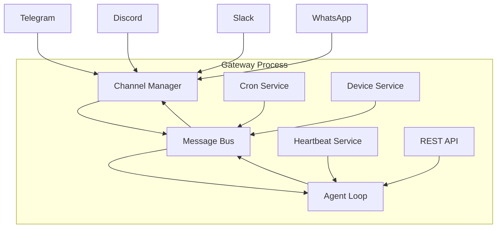

## Overview

The **Gateway** is Weaver's central coordinator that:
- Manages communication channel connections (Telegram, Discord, Slack, etc.)
- Routes messages between channels and agents via the message bus
- Provides REST API and health check endpoints
- Coordinates cron jobs and heartbeat monitoring
- Handles device event notifications

## Architecture

The gateway runs as a single long-lived process that orchestrates all agent communication:



## Starting the Gateway

From `cmd/weaver/main.go:520-690`:

```go
func gatewayCmd() {
    cfg, _ := loadConfig()
    provider, _ := providers.CreateProvider(cfg)
    
    // Core components
    msgBus := bus.NewMessageBus()
    agentLoop := agent.NewAgentLoop(cfg, msgBus, provider)
    channelManager, _ := channels.NewManager(cfg, msgBus)
    
    // Services
    cronService := setupCronTool(agentLoop, msgBus, workspace, restrict)
    heartbeatService := heartbeat.NewHeartbeatService(...)
    deviceService := devices.NewService(...)
    healthServer := health.NewServer(host, port, agentLoop)
    
    // Start everything
    cronService.Start()
    heartbeatService.Start()
    deviceService.Start(ctx)
    channelManager.StartAll(ctx)
    healthServer.Start()
    agentLoop.Run(ctx)
}
```

<Tabs>
  <Tab title="Docker Compose">
    ```yaml docker-compose.yml
    services:
      weaver-gateway:
        image: operatoronline/weaver:latest
        command: gateway
        volumes:
          - ./workspace:/root/.weaver/workspace
          - ./config.json:/root/.weaver/config.json
        environment:
          - GEMINI_API_KEY=${GEMINI_API_KEY}
          - TELEGRAM_BOT_TOKEN=${TELEGRAM_BOT_TOKEN}
        ports:
          - "8080:8080"
        restart: unless-stopped
    ```

    Start with:
    ```bash
    docker compose up -d weaver-gateway
    ```
  </Tab>

  <Tab title="CLI">
    ```bash
    weaver gateway
    ```

    With debug logging:
    ```bash
    weaver gateway --debug
    ```
  </Tab>

  <Tab title="Docker Run">
    ```bash
    docker run -d \
      --name weaver-gateway \
      -v $(pwd)/workspace:/root/.weaver/workspace \
      -v $(pwd)/config.json:/root/.weaver/config.json \
      -e GEMINI_API_KEY=$GEMINI_API_KEY \
      -e TELEGRAM_BOT_TOKEN=$TELEGRAM_BOT_TOKEN \
      -p 8080:8080 \
      operatoronline/weaver gateway
    ```
  </Tab>
</Tabs>

## Startup Sequence

When the gateway starts, it initializes components in order:

<Steps>
  <Step title="Load Configuration">
    Read `~/.weaver/config.json` and environment variables:
    ```json
    {
      "gateway": {
        "host": "0.0.0.0",
        "port": 8080
      },
      "channels": {
        "telegram": { "enabled": true },
        "discord": { "enabled": true }
      }
    }
    ```
  </Step>

  <Step title="Initialize Agent Loop">
    Create agent with tool registry:
    ```bash
    📦 Agent Status:
      • Tools: 15 loaded
      • Skills: 3/8 available
    ```
  </Step>

  <Step title="Start Channel Manager">
    Connect to enabled channels:
    ```bash
    ✓ Channels enabled: [telegram, discord, slack]
    ```
  </Step>

  <Step title="Start Services">
    ```bash
    ✓ Cron service started
    ✓ Heartbeat service started
    ✓ Device event service started
    ```
  </Step>

  <Step title="Start HTTP Server">
    ```bash
    ✓ Gateway started on 0.0.0.0:8080
    ✓ Gateway REST API available at http://0.0.0.0:8080/chat
    ✓ Health endpoints available at /health and /ready
    Press Ctrl+C to stop
    ```
  </Step>
</Steps>

## REST API

The gateway exposes HTTP endpoints for direct agent interaction:

### POST /chat

Send a message to the agent:

```bash
curl -X POST http://localhost:8080/chat \
  -H "Content-Type: application/json" \
  -d '{
    "message": "What files are in the current directory?",
    "session_key": "api-user-123"
  }'
```

Response:

```json
{
  "response": "Here are the files in the workspace:\n- AGENT.md\n- sessions/\n- cron/\n",
  "ui_commands": []
}
```

<ParamField path="message" type="string" required>
  The user's message to the agent
</ParamField>

<ParamField path="session_key" type="string">
  Session identifier for conversation history. Defaults to `"rest:default"`
</ParamField>

<ParamField path="channel" type="string">
  Target channel context. Defaults to `"cli"`
</ParamField>

<ParamField path="chat_id" type="string">
  Chat identifier for tool execution context
</ParamField>

<ParamField path="media" type="object">
  Media generation config (for image generation):
  ```json
  {
    "type": "image",
    "size": "1024x1024",
    "aspect_ratio": "1:1"
  }
  ```
</ParamField>

### GET /health

Basic liveness check:

```bash
curl http://localhost:8080/health
```

Response:

```json
{
  "status": "ok",
  "timestamp": 1704067200
}
```

### GET /ready

Readiness check with system details:

```bash
curl http://localhost:8080/ready
```

Response:

```json
{
  "status": "ready",
  "agent": {
    "model": "google/gemini-3-flash",
    "workspace": "/root/.weaver/workspace",
    "sessions": [
      {"key": "cli:default", "message_count": 12},
      {"key": "telegram:123", "message_count": 8}
    ],
    "subagents": [
      {"id": "task-abc", "status": "running", "task": "Analyze logs"}
    ]
  }
}
```

## Channel Manager

From `pkg/channels/manager.go:20-43`:

```go
type Manager struct {
    channels     map[string]Channel
    bus          *bus.MessageBus
    config       *config.Config
    dispatchTask *asyncTask
}

func (m *Manager) StartAll(ctx context.Context) error {
    // Start outbound message dispatcher
    go m.dispatchOutbound(ctx)
    
    // Start each enabled channel
    for name, channel := range m.channels {
        channel.Start(ctx)
    }
}
```

The channel manager automatically initializes enabled channels:

<Accordion title="Telegram">
  ```go
  if cfg.Channels.Telegram.Enabled && cfg.Channels.Telegram.Token != "" {
      telegram, _ := NewTelegramChannel(cfg, bus)
      m.channels["telegram"] = telegram
  }
  ```
  
  Configuration:
  ```json
  {
    "channels": {
      "telegram": {
        "enabled": true,
        "token": "YOUR_BOT_TOKEN"
      }
    }
  }
  ```
</Accordion>

<Accordion title="Discord">
  ```go
  if cfg.Channels.Discord.Enabled && cfg.Channels.Discord.Token != "" {
      discord, _ := NewDiscordChannel(cfg.Channels.Discord, bus)
      m.channels["discord"] = discord
  }
  ```
  
  Configuration:
  ```json
  {
    "channels": {
      "discord": {
        "enabled": true,
        "token": "YOUR_BOT_TOKEN"
      }
    }
  }
  ```
</Accordion>

<Accordion title="Slack">
  ```go
  if cfg.Channels.Slack.Enabled && cfg.Channels.Slack.BotToken != "" {
      slack, _ := NewSlackChannel(cfg.Channels.Slack, bus)
      m.channels["slack"] = slack
  }
  ```
  
  Configuration:
  ```json
  {
    "channels": {
      "slack": {
        "enabled": true,
        "bot_token": "xoxb-...",
        "app_token": "xapp-..."
      }
    }
  }
  ```
</Accordion>

See [Channels](/concepts/channels) for complete list of supported platforms.

## Message Dispatch

The gateway runs an outbound message dispatcher:

```go
func (m *Manager) dispatchOutbound(ctx context.Context) {
    for {
        select {
        case <-ctx.Done():
            return
        default:
            msg, ok := m.bus.SubscribeOutbound(ctx)
            if !ok {
                continue
            }
            
            // Skip internal channels (cli, system, subagent)
            if constants.IsInternalChannel(msg.Channel) {
                continue
            }
            
            channel, exists := m.channels[msg.Channel]
            if !exists {
                continue
            }
            
            channel.Send(ctx, msg)
        }
    }
}
```

<Info>
  Messages on internal channels (`cli`, `system`, `subagent`) are logged but not sent to external channels.
</Info>

## Services

### Cron Service

Scheduled task execution:

```go
cronService := cron.NewCronService(storePath, nil)
cronService.SetOnJob(func(job *cron.CronJob) (string, error) {
    result := cronTool.ExecuteJob(context.Background(), job)
    return result, nil
})
cronService.Start()
```

Jobs are executed by the agent with optional delivery:

```json
{
  "id": "job-abc",
  "message": "Check system health",
  "deliver": true,
  "channel": "telegram",
  "to": "123456"
}
```

### Heartbeat Service

Periodic agent checks:

```go
heartbeatService := heartbeat.NewHeartbeatService(
    workspace,
    cfg.Heartbeat.Interval,  // e.g., 300000 (5 minutes)
    cfg.Heartbeat.Enabled,
)
heartbeatService.SetHandler(func(prompt, channel, chatID string) *tools.ToolResult {
    response, _ := agentLoop.ProcessHeartbeat(ctx, prompt, channel, chatID)
    return tools.SilentResult(response)
})
```

Heartbeats run independently without session history.

### Device Service

USB device monitoring (Linux only):

```go
deviceService := devices.NewService(devices.Config{
    Enabled:    cfg.Devices.Enabled,
    MonitorUSB: cfg.Devices.MonitorUSB,
}, stateManager)
deviceService.SetBus(msgBus)
deviceService.Start(ctx)
```

On device connect/disconnect, sends notification to last active channel.

## Monitoring

The gateway provides observability through structured logging:

```go
logger.InfoCF("channels", "Message received", map[string]interface{}{
    "channel": "telegram",
    "chat_id": "123456",
    "sender": "@username",
})

logger.InfoCF("agent", "LLM request", map[string]interface{}{
    "model": "gemini-3-flash",
    "tools_count": 15,
    "iteration": 1,
})
```

Enable debug logging:

```bash
weaver gateway --debug
```

Logs are written to:
- Console (stdout)
- File: `~/.weaver/logs/weaver.log` (if configured)

## Graceful Shutdown

The gateway handles SIGINT/SIGTERM gracefully:

```go
sigChan := make(chan os.Signal, 1)
signal.Notify(sigChan, os.Interrupt)
<-sigChan

fmt.Println("\nShutting down...")
cancel()  // Cancel context
healthServer.Stop(ctx)
deviceService.Stop()
heartbeatService.Stop()
cronService.Stop()
agentLoop.Stop()
channelManager.StopAll(ctx)
```

This ensures:
- In-flight messages are processed
- Channels disconnect cleanly
- Session state is saved
- Cron jobs are persisted

## High Availability

For production deployments:

<Steps>
  <Step title="Shared Workspace">
    Mount workspace on shared storage (NFS, EBS, etc.):
    ```yaml
    volumes:
      - /mnt/shared/workspace:/root/.weaver/workspace
    ```
  </Step>

  <Step title="Load Balancer">
    Run multiple gateway instances behind a load balancer:
    ```yaml
    services:
      weaver-1:
        image: operatoronline/weaver
        # ...
      weaver-2:
        image: operatoronline/weaver
        # ...
      
      nginx:
        image: nginx
        ports:
          - "80:80"
        depends_on: [weaver-1, weaver-2]
    ```
  </Step>

  <Step title="Health Checks">
    Configure load balancer health checks:
    ```nginx
    upstream weaver {
        server weaver-1:8080;
        server weaver-2:8080;
    }
    
    location /health {
        proxy_pass http://weaver;
        proxy_connect_timeout 1s;
    }
    ```
  </Step>
</Steps>

<Warning>
  Channel connections (Telegram, Discord) must be handled by a single gateway instance. Use sticky sessions or dedicated channel gateways.
</Warning>

## Next Steps

<CardGroup cols={2}>
  <Card title="Channels" icon="message" href="/concepts/channels">
    Configure communication channels
  </Card>
  <Card title="Configuration" icon="gear" href="/customize/configuration">
    Learn about gateway configuration options
  </Card>
</CardGroup>
